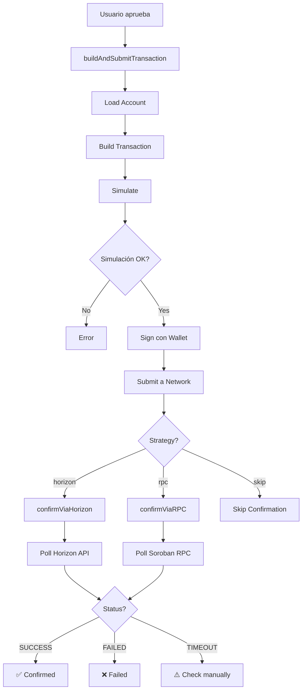

# AstroSwap Frontend Architecture

## Modular Design - Production Ready

### Overview

El frontend ha sido refactorizado con **arquitectura modular y escalable** para soportar usuarios reales en testnet y mainnet.

## Estructura del Proyecto

```
frontend/
├── src/
│   ├── lib/
│   │   ├── stellar/           # 🆕 Módulo Stellar (modular)
│   │   │   ├── config.ts      # Configuración centralizada
│   │   │   ├── errors.ts      # Manejo de errores
│   │   │   ├── confirmation.ts # Estrategias de confirmación
│   │   │   ├── transaction.ts  # Transaction management
│   │   │   ├── accounts.ts     # Account operations
│   │   │   ├── index.ts        # Re-exports
│   │   │   └── README.md       # Documentación completa
│   │   ├── stellar.ts         # Wrapper backwards compatible
│   │   ├── contracts.ts       # Contract interactions
│   │   ├── wallet-kit.ts      # Wallet integration
│   │   ├── rate-limiter.ts    # API rate limiting
│   │   └── errors.ts          # Error parsing
│   ├── components/
│   ├── pages/
│   ├── hooks/
│   └── stores/
└── .env
```

## Módulo Stellar - Arquitectura Modular

### Beneficios

✅ **Separación de responsabilidades** - cada archivo tiene un propósito único
✅ **Testeable** - módulos independientes, fácil unit testing
✅ **Escalable** - agregar features sin modificar código existente
✅ **Configurable** - cambiar comportamiento vía .env
✅ **Type-safe** - TypeScript completo
✅ **Backwards compatible** - código antiguo sigue funcionando

### Módulos

#### 1. config.ts - Configuración Centralizada

Single source of truth para toda la configuración de red:

```typescript
import { NETWORK_CONFIG, horizonServer, sorobanServer } from '@/lib/stellar/config';

// Acceso a config
console.log(NETWORK_CONFIG.network); // 'testnet' | 'mainnet'
console.log(NETWORK_CONFIG.confirmationStrategy); // 'horizon' | 'rpc' | 'skip'
```

#### 2. errors.ts - Manejo de Errores

Parseo centralizado de errores de Stellar SDK:

```typescript
import { parseError, StellarTransactionError } from '@/lib/stellar/errors';

try {
  await operation();
} catch (error) {
  const { message, code } = parseError(error);
  // code: 'INSUFFICIENT_BALANCE', 'TIMEOUT', 'USER_REJECTED', etc.
}
```

#### 3. confirmation.ts - Estrategias de Confirmación

Múltiples estrategias para confirmar transacciones:

- **Horizon** (recomendado): Más confiable, usa Horizon API
- **RPC**: Más rápido pero inestable en testnet (XDR parsing issues)
- **Skip**: Solo para desarrollo

```typescript
import { confirmTransaction } from '@/lib/stellar/confirmation';

const result = await confirmTransaction(txHash);
// result.status: 'SUCCESS' | 'FAILED' | 'PENDING' | 'NOT_FOUND'
```

#### 4. transaction.ts - Transaction Manager

Construye, simula, firma y envía transacciones:

```typescript
import { buildAndSubmitTransaction, type WalletSigner } from '@/lib/stellar/transaction';

const result = await buildAndSubmitTransaction({
  sourceAddress: 'GXXX...',
  operations: [op1, op2],
  signer: walletSigner,
});

console.log(result.hash);
console.log(result.confirmation.status);
```

#### 5. accounts.ts - Account Operations

Operaciones de cuentas y balances:

```typescript
import { getAccountBalance, getTokenBalance } from '@/lib/stellar/accounts';

const xlmBalance = await getAccountBalance(address);
const tokenBalance = await getTokenBalance(address, tokenAddress);
```

## Configuración de Producción

### Estrategia de Confirmación

Configurar en `.env`:

```bash
# Producción (recomendado)
VITE_CONFIRMATION_STRATEGY=horizon

# Desarrollo/Testing rápido (inestable en testnet)
VITE_CONFIRMATION_STRATEGY=rpc

# Solo desarrollo (no espera confirmación)
VITE_CONFIRMATION_STRATEGY=skip
```

### Networks

```bash
# Testnet (actual)
VITE_STELLAR_NETWORK=testnet

# Mainnet (futuro)
VITE_STELLAR_NETWORK=mainnet
```

## Flujo de Transacción



## Issues Resueltos

### 1. XDR Parsing Errors (SDK v13 → v14)

**Problema**: "Bad union switch: 4" al llamar `getTransaction()`
**Solución**: 
- Upgrade a SDK v14.6.1 ✅
- Múltiples estrategias de confirmación ✅
- Horizon fallback para máxima confiabilidad ✅

### 2. Confirmación de Transacciones

**Problema**: RPC inestable en testnet, timeouts constantes
**Solución**:
- Estrategia Horizon (usa Horizon API directamente) ✅
- Configurable vía .env ✅
- Logging comprehensivo para debugging ✅

### 3. Código No Escalable

**Problema**: Todo en un solo archivo `stellar.ts` de 400+ líneas
**Solución**:
- Arquitectura modular (7 archivos especializados) ✅
- Backwards compatible ✅
- Documentación completa ✅

## Testing

```bash
# Unit tests (módulos individuales)
pnpm test src/lib/stellar/

# Integration tests
pnpm test:integration

# Coverage
pnpm test:coverage
```

## Roadmap

- [ ] Retry logic con exponential backoff
- [ ] Contract call caching
- [ ] Métricas/monitoring
- [ ] WebSocket streaming para confirmaciones
- [ ] Multi-signature support
- [ ] Transaction batching

## Migración de Código Antiguo

### Paso 1: No cambiar nada (backwards compatible)

```typescript
// ✅ Código antiguo sigue funcionando
import { buildAndSubmitTransaction } from '@/lib/stellar';
```

### Paso 2: Migrar gradualmente

```typescript
// ✅ Código nuevo (preferido)
import { buildAndSubmitTransaction } from '@/lib/stellar/transaction';
import { confirmViaHorizon } from '@/lib/stellar/confirmation';
import { parseError } from '@/lib/stellar/errors';
```

### Paso 3: Remover wrapper (futuro)

Cuando todo esté migrado, eliminar `stellar.ts` wrapper.

## Documentación

Ver `/src/lib/stellar/README.md` para documentación detallada de cada módulo.
